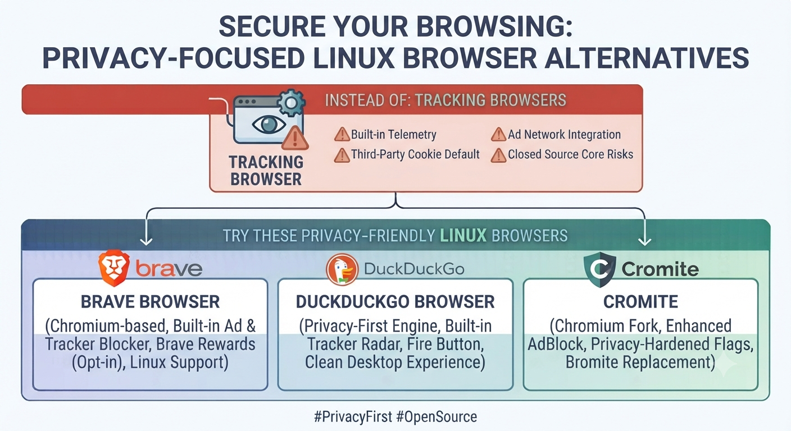

# Do Not Use
*Browser* :  Chrome

+ fast

- _deep-dive into Google Ecosystem which is not wished for privacy_
- _Closed Source_
- _risky for a private Browsing experience_

# Do Use
Browser : Brave,DuckDuckGo,Cromite

Option Brave :

Chromium Based, Built-in Ad & Tracking Blocker
Option DuckDuckGo :

Privacy First, Bult-in Tracker Scanner & Fire Button (deletes every Tab)
Option Cromite : 

My personal favorite. Built with Chromium, enhanced Privacy settings with integrated AdBlock. Replaces the "Bromite" project.

