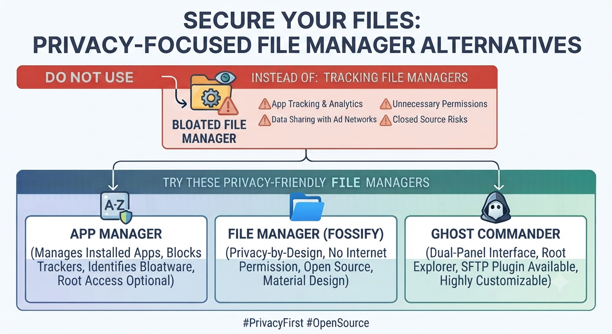

# Do Not Use
# Files by Google

+ good for Google Ecosystem
+ has almost every feature a File Manager needs

- deep-dive into Google Ecosystem which is not wished for privacy
- Closed Source
- risky for a privacy setup beause of "Google"

# Do Use
File Manager: App Manager, Fossify File Manager & Ghost Commander

__App Manager__ : 

A very mighty tool. A lot more than just a File Manager. You can manage installed apps, block trackers, identify bloatware, and optionally use root access.
It definitely requires root or advanced setup to unlock its full potential, but gives ultimate control.

 
__Fossify File Manager__ : 

KISS (Keep it Simple, stupid), clean Interface without any options you won't use. Privacy-by-design approach, requires no internet permission, open source, and built with clean Material Design.

__Option Ghost Commander__ :

There is a also a version for Linux , called Midnight-Commander or GNOME-Commander.
Dual-panel interface, powerful root explorer, SFTP plugin available, and highly customizable.
