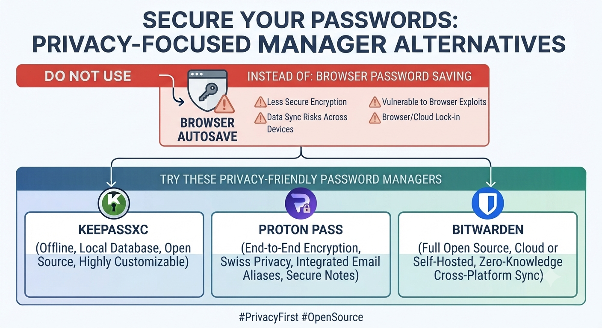

# Do Not Use

__Password Manager__ :
# Google Password Manager / Built-in Browser Managers

-Seamless auto-fill out-of-the-box on Android and desktop
-Zero setup required
-Deep integration into the tracking ecosystem (Google/Apple)
-Closed Source core risks and centralized cloud storage of all sensitive credentials
-Single point of failure for your entire digital identity

# Do Use

__Password Manager__ :

- KeePassXC, Proton Pass, Bitwarden

__KeePassXC__ : A powerful offline password manager. It stores your encrypted database (.kdbx) entirely locally on your device, meaning zero cloud reliance and absolute data ownership. Perfect for desktop usage with robust AES-256 encryption.

__Proton Pass__ : End-to-end encrypted password manager built by the privacy-focused team behind Proton. Features modern apps, alias generation to hide your real email address, and open-source transparency.

__Bitwarden__ : A widely trusted, open-source password manager with a strong zero-knowledge architecture. It offers seamless cross-platform syncing while ensuring your master key and vault data remain strictly encrypted on your client devices.
